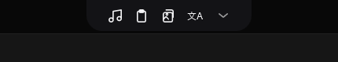
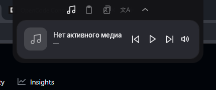
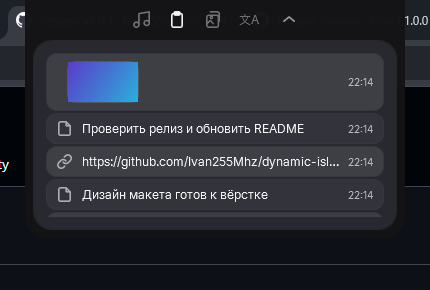
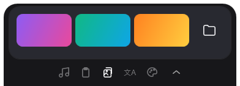
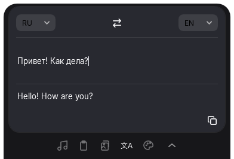
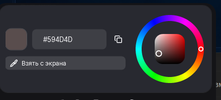

# Dynamic Island для Windows

Оверлей в стиле iPhone Dynamic Island для Windows: «чёлка» прилипает к верху экрана и раскрывается при наведении. Внутри — управление музыкой, история буфера обмена, последние скриншоты и быстрый переводчик.



## Возможности

- **Свёрнутая «чёлка»**: мини-плеер (обложка, трек, анимированный эквалайзер) когда играет музыка, иначе — ряд иконок разделов.
- **Наведение** — панель плавно раскрывается; клик закрепляет, `⌃` сворачивает; ПКМ по чёлке — меню.
- **Музыка** — любой источник Windows через GSMTC (в т.ч. Яндекс.Музыка в браузере): обложка, название/исполнитель, `⏮ ⏸ ⏭`, переключение звука.
- **Буфер обмена** — только **уникальные** записи, текст / ссылки / изображения с аккуратными миниатюрами; клик по записи возвращает её в буфер.
- **Скриншоты** — последние снимки из системной папки; клик открывает файл в проводнике, иконка папки — саму папку.
- **Переводчик** — авто-перевод по мере ввода, языки RU/EN/DE/FR/ES/AUTO, `Swap`, `Enter` — перевести сразу, копирование результата одной кнопкой.
- **Пипетка (Color Picker)** — колесо тона + квадрат яркости/насыщенности, HEX с копированием в один клик и **живой пик с экрана**: панель с зумом 13×13 пикселей следует за курсором и обновляется в реальном времени, ЛКМ — выбрать, ПКМ / Esc — отмена.
- **Трей** — «Показать», «Расположение», «Запускать с Windows», «Перезапустить», «Выход» (двойной клик по иконке — перезапуск).
- **Положение острова** — сверху или снизу (над панелью задач); настройка сохраняется.
- **Защита от дублей** приложения (второй запуск закрывается).

## Скриншоты

| | |
|---|---|
|  |  |
|  |  |
|  |  |

## Требования

- Windows 10 1809+ (x64) или Windows 11
- Интернет — только для переводчика
- Для релизной сборки .NET **не нужен** (self-contained)

## Установка

1. Скачай `DynamicIsland-1.0.3-win-x64.zip` со страницы [Releases](../../releases).
2. Распакуй в удобную постоянную папку (например, `C:\Tools\DynamicIsland`).
3. Запусти `DynamicIsland.exe`.
4. Приложение не подписано, поэтому SmartScreen покажет «Неизвестный издатель» — нажми **«Подробнее» → «Выполнить в любом случае»**.

Автозапуск: правый клик по иконке в трее → **«Запускать с Windows»**. Если перенесёшь exe в другую папку — включи автозапуск заново.

> Иконка в трее может быть скрыта Windows: **Параметры → Персонализация → Панель задач → «Выберите значки, отображаемые в панели задач»** → включить Dynamic Island.

## Управление

| Действие | Что делает |
|---|---|
| Наведение на чёлку | раскрывает панель |
| Клик по чёлке | закрепляет раскрытой |
| `⌃` в панели | свернуть |
| ПКМ по чёлке | меню (свернуть / перезапустить / выход) |
| Иконки разделов | Музыка · Буфер обмена · Скриншоты · Переводчик · Пипетка |
| Клик по записи буфера | вернуть в буфер обмена |
| Клик по скриншоту | показать файл в проводнике |
| Иконка папки (скриншоты) | открыть папку со скриншотами |
| Положение | меню трея → «Расположение» (или ПКМ по чёлке) |
| `Enter` в переводчике | перевести сразу (`Shift+Enter` — новая строка) |

## Сборка из исходников

Нужен [.NET 10 SDK](https://dotnet.microsoft.com/download).

```powershell
# запуск из исходников
dotnet run --project src/DynamicIsland

# релизная сборка (один self-contained exe)
dotnet publish src/DynamicIsland -c Release -r win-x64 --self-contained true `
  -p:PublishSingleFile=true -p:IncludeNativeLibrariesForSelfExtract=true `
  -p:EnableCompressionInSingleFile=true -p:DebugType=none
```

## Технологии

- .NET 10 · WPF
- [CommunityToolkit.Mvvm](https://github.com/CommunityToolkit/dotnet)
- Windows GSMTC (`Windows.Media.Control`) — медиа-сессии
- Core Audio (Win32 COM) — переключение звука
- Свободные эндпоинты Google Translate — перевод
- Шрифт [Inter](https://github.com/rsms/inter) (OFL) встроен в приложение

## Известные ограничения

- Приложение **не подписано** — SmartScreen будет предупреждать при первом запуске.
- Переводчик использует бесплатные эндпоинты Google — возможны временные лимиты (429); есть резервный эндпоинт.
- Кнопка звука переключает **общий системный mute** (GSMTC не управляет громкостью конкретного плеера).
- Медиа-панель работает, пока источник публикует медиа-сессию (у браузеров — вкладка с поддержкой Media Session).
- Автозапуск привязан к пути exe — не перемещай папку после включения.

## Лицензия

[MIT](LICENSE)

---

# Dynamic Island for Windows (EN)

An iPhone-style Dynamic Island overlay for Windows: a notch-like pill at the top of the screen that expands on hover. Features media controls (any GSMTC source, including Yandex Music in a browser), unique clipboard history with image thumbnails, recent screenshots and a quick translator. See the screenshots above and the Russian sections for details. Build with .NET 10 / WPF. Licensed under MIT.
